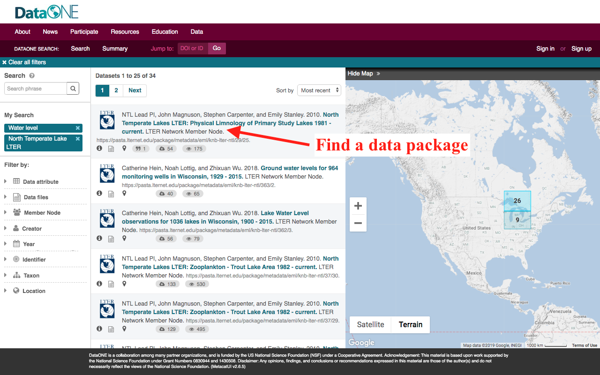
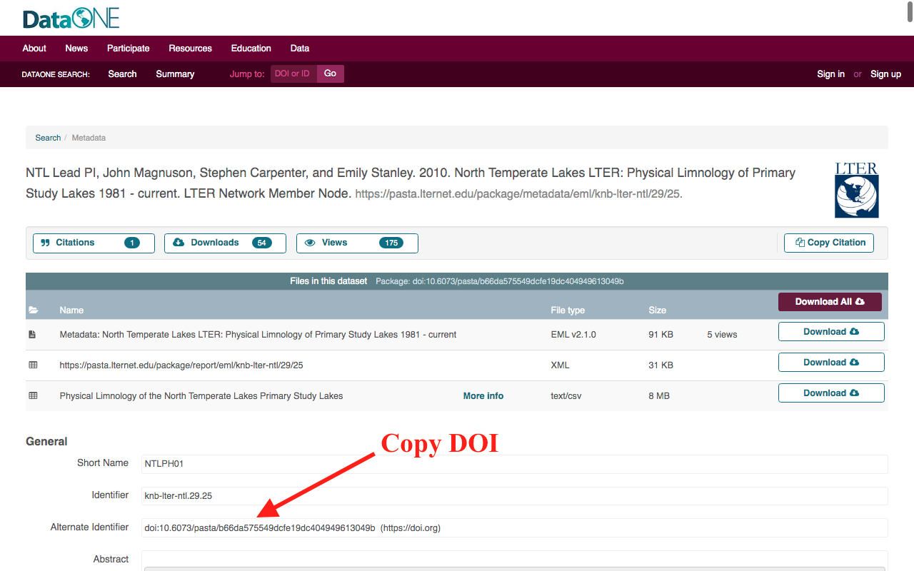
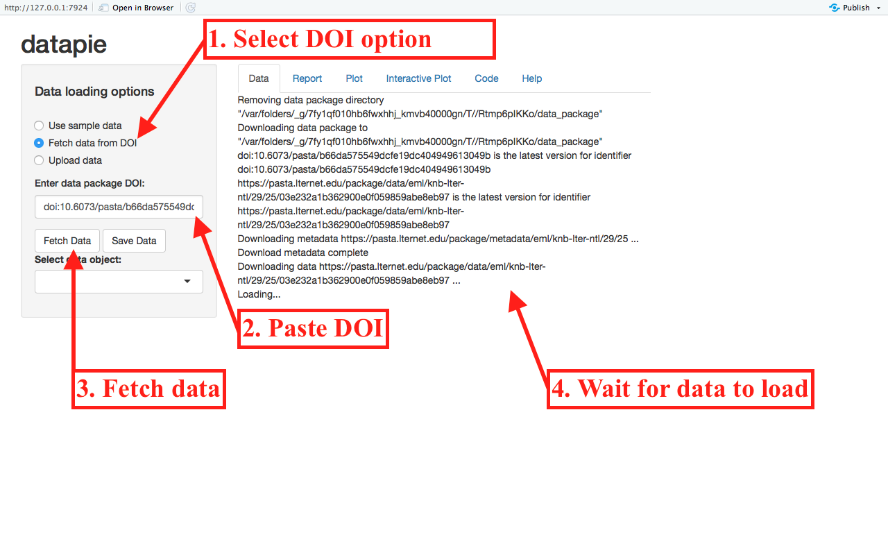
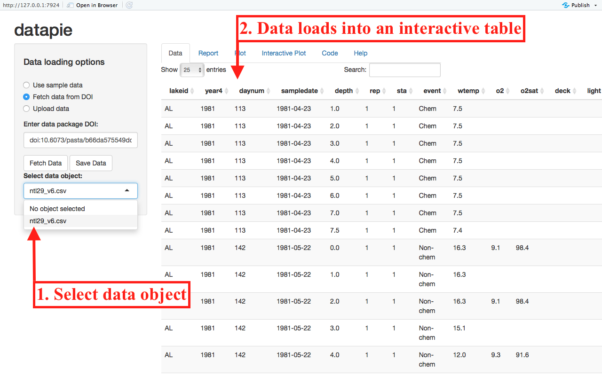
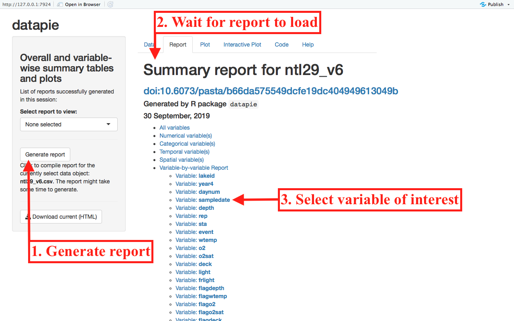
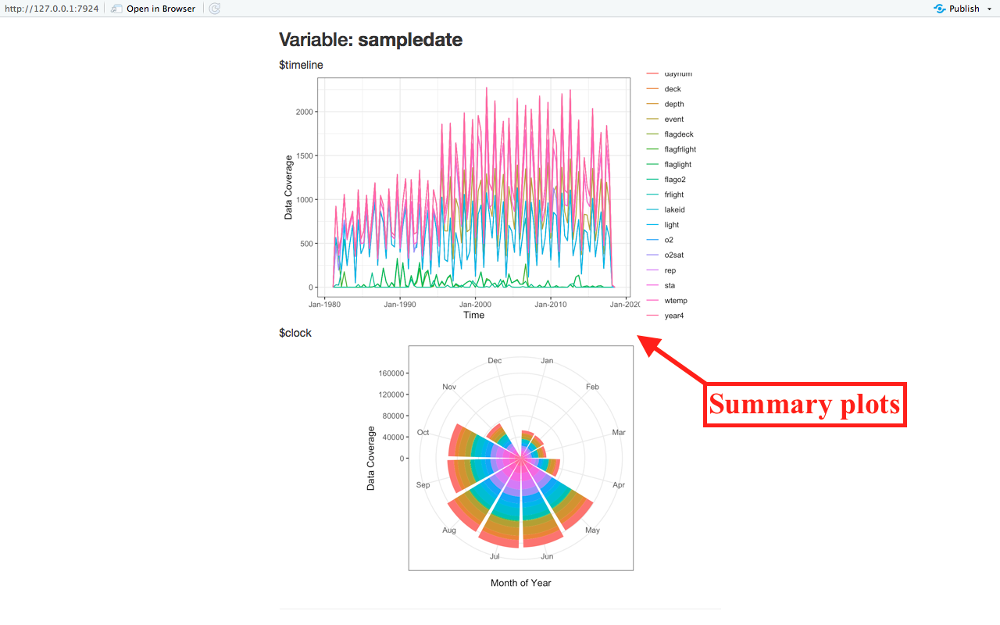
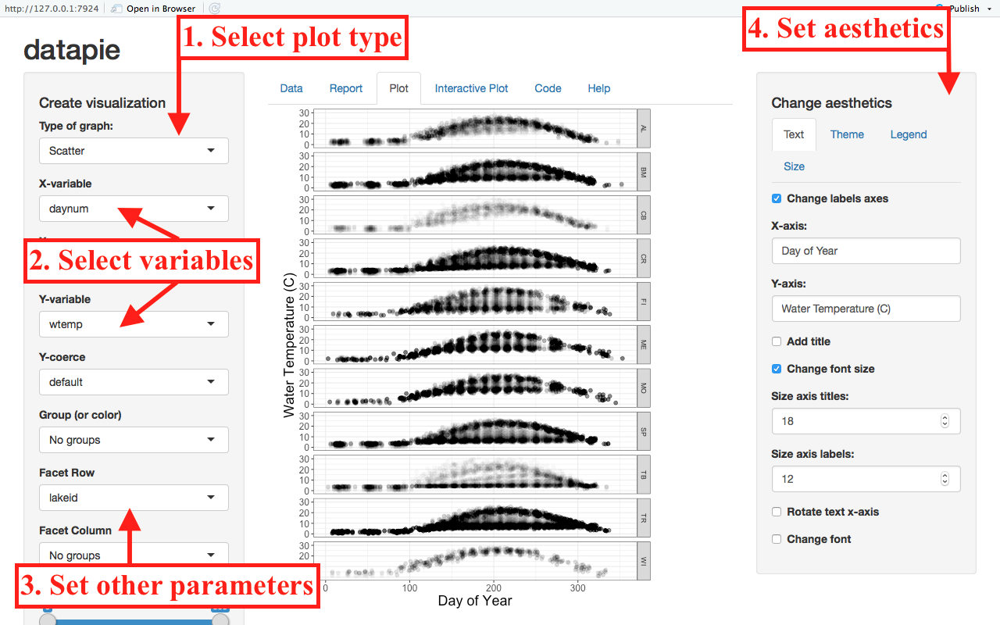
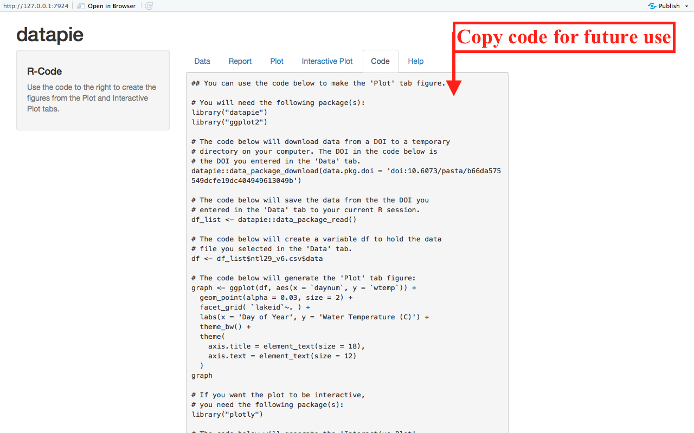
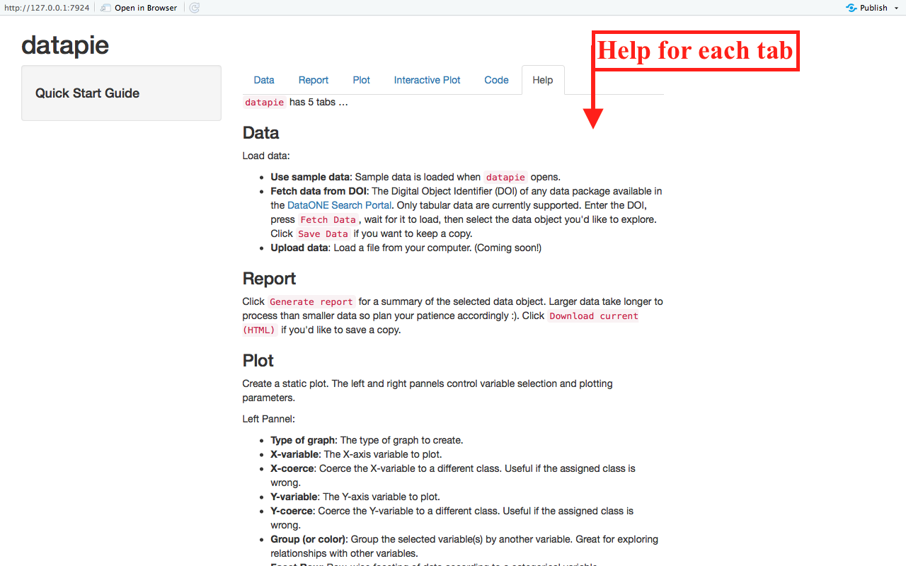
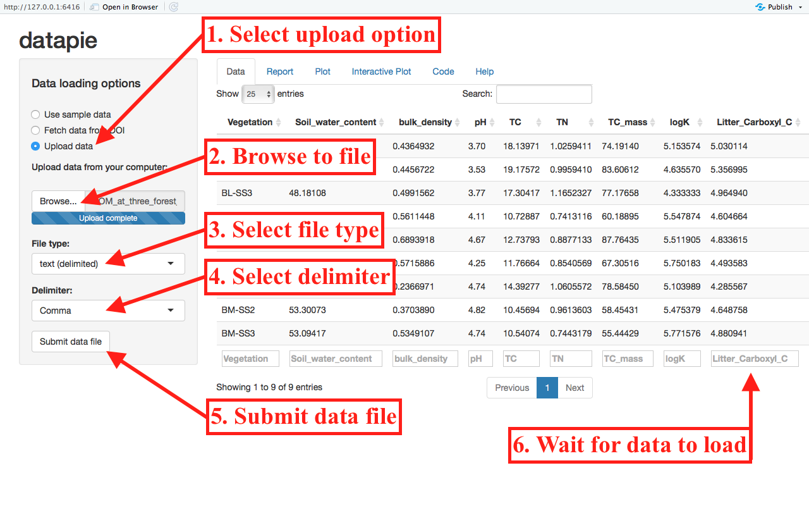

_NOTE: Only tabular data (i.e. .csv, .tsv, delimited .txt files, and some .xlsx) are supported at this time. Loading a data package containing both supported and unsupported data types will allow access to only the supported data._

\  
\  
\  
\  

# Find a data package

Find a data package of interest from the [DataONE Network Search Portal](https://search.dataone.org/data) and copy the DOI.

\  
\  

```{r, message = FALSE, echo = FALSE, out.width = "800px"}

```

\  
\  

```{r, message = FALSE, echo = FALSE, out.width = "800px"}

```

\  
\  
\  
\  

# Load data and select object (Data tab)

\  
\  

```{r, message = FALSE, echo = FALSE, out.width = "800px"}

```

\  
\  

```{r, message = FALSE, echo = FALSE, out.width = "800px"}

```

\  
\  
\  
\  

# Create summary report (Report tab)

\  
\  

```{r, message = FALSE, echo = FALSE, out.width = "800px"}

```

\  
\  

```{r, message = FALSE, echo = FALSE, out.width = "800px"}

```

\  
\  
\  
\  

# Plot (Plot and Interactive Plot tabs)

\  
\  

```{r, message = FALSE, echo = FALSE, out.width = "800px"}

```

\  
\  
\  
\  

# Export code (Code tab)

\  
\  

```{r, message = FALSE, echo = FALSE, out.width = "800px"}

```

\  
\  
\  
\  

# Understand interface features (Help tab)
\  
\  

```{r, message = FALSE, echo = FALSE, out.width = "800px"}

```

\  
\  
\  
\  

# Load data from file (Data tab)

You can also load data files from your computer!

\  
\  

```{r, message = FALSE, echo = FALSE, out.width = "800px"}

```

\  
\  
\  
\  

